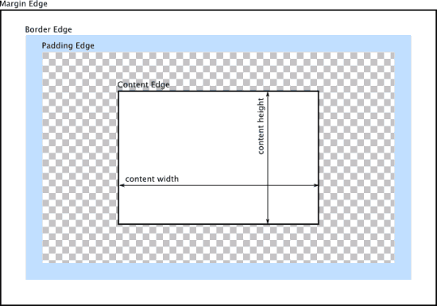

# 阿里前端社招一


## CSS部分

### CSS盒模型

document中所有元素被表示为一个[盒子模型](https://developer.mozilla.org/zh-CN/docs/Web/CSS/CSS_Box_Model/Introduction_to_the_CSS_box_model)，描述元素所占空间内容。每个盒子共有4边，从外到内分别如下。
>1. margin edge
>2. border edge
>3. padding edge
>4. content edge

标准盒模型height、width控制content，如下图。  
[](https://developer.mozilla.org/zh-CN/docs/Web/CSS/CSS_Box_Model/Introduction_to_the_CSS_box_model)

IE盒模型height、width包括content、padding、border，如下图。  
[](https://www.jianshu.com/p/cc2bc404269b)


### box-sizing应用场景

[box-sizing的使用场景](https://www.jianshu.com/p/3375b15f568f)

| box-sizing属性值 | 类型      | 含义                         | 场景                                   |
|:----------------|:----------|:-----------------------------|:---------------------------------------|
| border-box      | IE盒模型  | width=content+padding+border | 表单多项padding、border不同时保证长度一致 |
| content-box     | 标准盒模型 | width=content width          | -                                      |


### flex弹性布局

- [Flex 布局教程：语法篇](http://www.ruanyifeng.com/blog/2015/07/flex-grammar.html)
- [Flex 布局示例](http://static.vgee.cn/static/index.html)

#### 相关概念

| 名称                                  | 含义                          |
|:--------------------------------------|:-----------------------------|
| [flex container](#flex-container属性) | 采用 Flex 布局的元素           |
| [flex item](#flex-item属性)           | 子元素                        |
| main axis                             | 默认水平方向，主轴             |
| cross axis                            | 默认垂直方向，交叉轴            |
| main start                            | 主轴的开始位置（与边框的交叉点） |
| main end                              | 主轴的结束位置                 |
| cross start                           | 交叉轴的开始位置               |
| cross end                             | 交叉轴的结束位置               |
| main size                             | flex item占据的主轴的空间      |
| cross size                            | cross item占据的主轴的空间     |

#### flex container属性

| 属性名           | 含义                                    | 可选值                                                                        | 默认值      |
|:----------------|:----------------------------------------|:-----------------------------------------------------------------------------|:-----------|
| flex-direction  | 设置主轴方向                             | row ; row-reverse ; column ; column-reverse                               | row        |
| flex-wrap       | 设置flex item换行方式                    | nowrap ; wrap ; wrap-reverse                                               | nowrap     |
| flex-flow       | flex-direction和flex-wrap属性的简写形式   | 见flex-direction和flex-wrap可选值                                             | row nowrap |
| justify-content | 定义flex item在主轴上的对齐方式           | flex-start ; flex-end ; center ; space-between ; space-around            | flex-start |
| align-items     | 定义flex item在交叉轴上的对齐方式          | flex-start ; flex-end ; center ; baseline ; stretch                      | stretch    |
| align-content   | 定义了多根主轴线的对齐方式，一根时该属性无效 | flex-start ; flex-end ; center ; space-between ; space-around ; stretch | stretch    |

#### flex item属性

| 属性名       | 含义                                                                        | 可选值                                                           | 默认值        |
|:------------|:----------------------------------------------------------------------------|:----------------------------------------------------------------|:-------------|
| order       | 定义item的排序顺序（小->大），可负数                                           | 整数                                                            | 0            |
| flex-grow   | container存在剩余空间时item的放大比例                                          | 非负整数                                                         | 0（不放大）   |
| flex-shrink | container空间不足时item的缩小比例                                             | 非负整数                                                         | 1（正常缩小） |
| flex-basis  | 定义在分配多余空间之前item占据的主轴空间。浏览器根据这个属性，计算主轴是否有多余空间 | {length} ; auto                                                | auto         |
| flex        | flex-grow, flex-shrink 和 flex-basis的简写                                   | 见flex-grow, flex-shrink 和 flex-basis属性可选值                 | 0 1 auto     |
| align-self  | 允许单个项目有与其他项目不一样的对齐方式，可覆盖align-items属性                   | auto ; flex-start ; flex-end ; center ; baseline ; stretch | auto         |

### 未知宽高元素如何水平垂直居中

假定未知宽高元素为item，其父元素为container，对container做以下css样式控制。

```css
#container {
    background-color: #ffe665;
    height: 400px;
    display: flex;
    justify-content: center;
    align-items: center;
}
```

## JS部分

### 原型链、对象、构造函数之间的关系

## JS常见跨域手段。jsonp原理、cors如何设置

### 对象数组深度拷贝实现原理

### 如何获取一个元素到视图顶部的距离

### getBoundingClientRect获取的top和offsetTop获取的top区别

### 事件委托

### XSS是什么，攻击原理，怎么预防

### webpack实现原理与机制

### webpack配置entry多入口时配合CommonChunkPlugin时，代码如何切割

### webpack.optimze.UglifyJsPlugin压缩速度慢，如何提升

### webpack loader原理和机制，有没有写过

### babel插件transform-runtime和stage-2的作用

### babel将ES6转换ES5原理

### ES6箭头函数this问题，常见拓展运算符

### 对JS模块化规范CommonJs、UMD、CMD的理解，与ES6模块有何区别


## 网络协议

### http2.0、https、websocket特性

### http返回码200和304含义


## 算法

### 分查找的时间复杂度是多少，如何计算


## 数据结构

### 线性顺序存储结构和链式存储结构有什么区别？以及优缺点


## 持续集成

### git大型项目合作，如何持续集成


## 现场实战题

### 白板写代码，用最简洁的代码实现数组去重。


## 开放性试题

### 说一下以往项目用到的技术栈，有何难点，是如何解决的。

### 说一下以往项目可以改进的地方以及做的优秀的地方。


## 参考

- [面试分享：一年经验初探阿里巴巴前端社招](http://segmentfault.com/p/1210000010573211)
